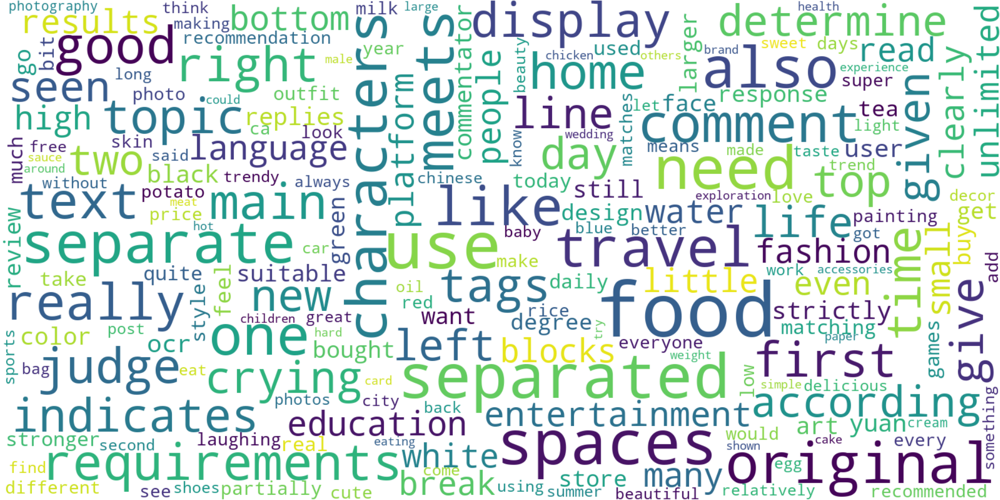
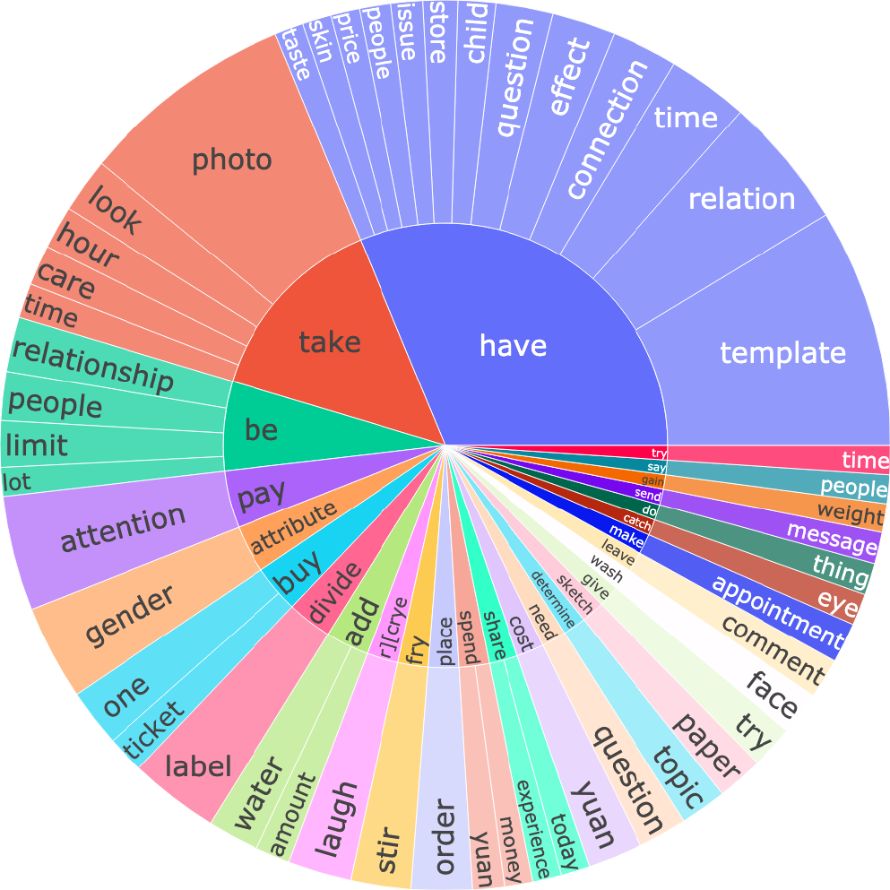
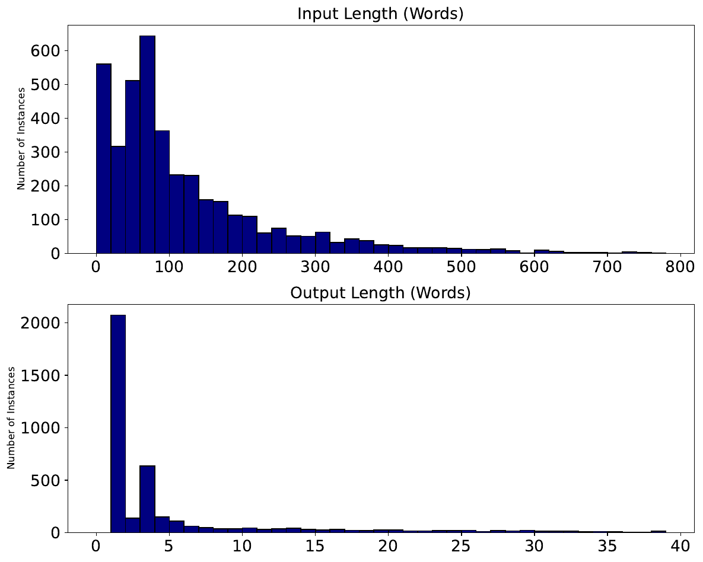

# SNS-Bench-VL

# Image Data

https://drive.google.com/file/d/11U4xBss_AiPPCupP1WJI5W7Ad6UYsNXV/view?usp=sharing

# Dataset Statistics

SNS-Bench-VL contains **4,001 multimodal samples** spanning three core capabilities and eight representative Social Networking Service (SNS) tasks. The benchmark includes 2,380 samples for content understanding, 721 for information retrieval, and 900 for personalized recommendation.

| Category | Task | Amount |
| --- | --- | ---: |
| Content Understanding | OCR | 308 |
| Content Understanding | MRC | 854 |
| Content Understanding | HashtagAssign (Single) | 548 |
| Content Understanding | HashtagAssign (Multiple) | 366 |
| Content Understanding | CommentSelect (Primary) | 115 |
| Content Understanding | CommentSelect (Nested) | 189 |
| Information Retrieval | QueryRA (Binary Score) | 166 |
| Information Retrieval | QueryRA (Five-Level Score) | 71 |
| Information Retrieval | QueryGen | 484 |
| Personalized Recommendation | GenderMatch | 77 |
| Personalized Recommendation | TaxonomyCat (Single Level) | 347 |
| Personalized Recommendation | TaxonomyCat (Three Levels) | 476 |
| **Total** | **Questions** | **4,001** |

The average question and answer lengths are **16.75 words** and **2.78 words**, respectively. In total, the benchmark contains **66,998 question tokens** and **11,109 answer tokens**.

## Topic Distribution

The word cloud highlights the broad range of topics covered by SNS-Bench-VL, from consumer themes such as food, fashion, and outfits to lifestyle interests such as travel, home, and style. Interaction-oriented, practical, emotional, and daily-life terms further reflect the diversity of real-world SNS content.

  

## Instruction Patterns

The top 50 frequent verb-noun pairs in user instructions reveal common SNS interaction patterns. Core verbs such as *have*, *take*, and *pay* combine with nouns such as *photo*, *time*, and *attention*, while more complex pairs such as *make appointment* and *attribute gender* illustrate the benchmark's diverse user behaviors and contextual reasoning requirements.

  

## Sequence Lengths

Most complete model inputs contain fewer than 300 words, with the largest concentration in the 60-80 word range. This distribution includes the associated SNS context and is therefore longer than the question-only average reported above. Answers are typically limited to fewer than 20 words because many tasks use multiple-choice or concise, well-defined response formats, which supports reliable automatic evaluation.

  

# 🤝 Contributing & Contact

If you’re interested in LLM/VLM for social media, we’d love to collaborate or hear from you!
